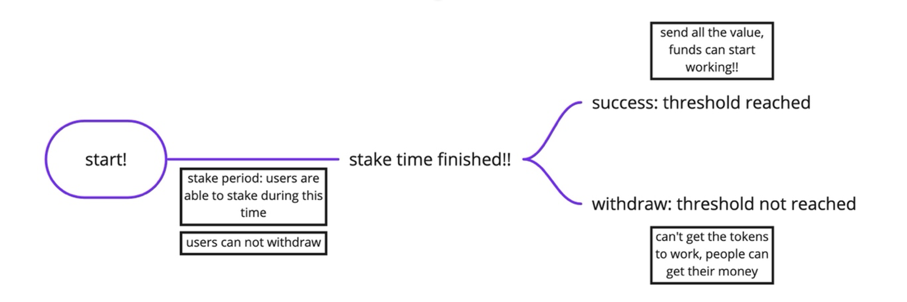
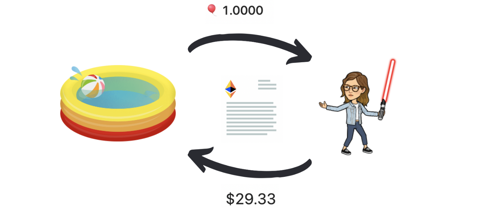
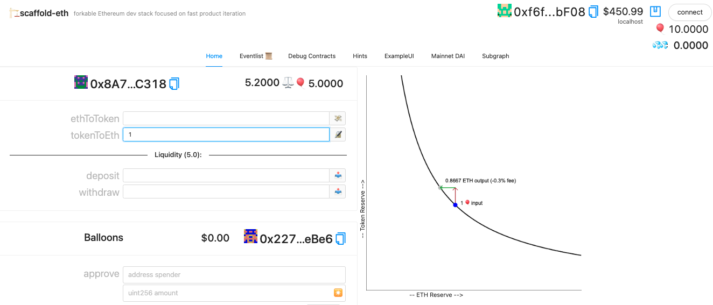

# Speed Running Ethereum

I'm [speeding running ethereum](https://speedrunethereum.com/) by [Austin Griffith](https://twitter.com/austingriffith)! 

Here are my notes & key learnings on the way!

----

## ✅ Challenge 0: 🎟 Simple NFT Example

**[Live Demo](https://challenge0-speedrunning.surge.sh/)**,  **[Contract](https://rinkeby.etherscan.io/address/0x1aEda3999686e3933DEf92bF6A87228043985398)**

This challange shows how to deploy a contract, how to upload it to a hosting platform, test it out on the interface and work with burner wallets. You will not be coding ,but its important to give you an idea of how scaffold-eth works & the different components. 

Here are some key learnings:
- Working with IPFS, how it uses hash. Here's a [video on IPFS.](https://www.youtube.com/watch?v=5Uj6uR3fp-U&ab_channel=SimplyExplained)
- ERC721: Minting the NFT & transfer to wallet 
- Verifing a contract on Etherscan
- Notes: you can run **yarn test** for automated testing in speedrun!

Here's my [post](https://eda.hashnode.dev/create-your-own-nft-collection-on-ethereum) I wrote on how to create an NFT Collection 

## ✅ Challenge 1: 🥩 Decentralized Staking App

**[Live Demo](https://challenge1-speedrunning.surge.sh/)**, **[Contract](https://rinkeby.etherscan.io/address/0x1175D26ff811ccCf7FB54CC889295df66876CE8C#code)**

Staking App allows to coordinates economic activity (super power of crypto). It basically 'locks' up your funds for a certain time. You can withdraw or the funds can be used for a certain purpose. *For example lets say you want to raise funds to buy the Mona Lisa, you can raise money from anyone why wants to contribute and you don't end up buying in the end people can withdraw their funds. Likewise you can raise money to buy the US Constitution :-)*

In Proof of Stake blockchain, you stake so that the blockchain can put these tokens to work. If you stake your crypto, it will become part of the process to validate/approve/add to the blockchain, transactions are validated by people who stake the tokens. For more on Staking: [Ethereum Staking](https://ethereum.org/en/staking/#stake) and [WhiteBoard Crypto.](https://www.youtube.com/watch?v=vZ2UZdB07fo&ab_channel=WhiteboardCrypto)

* The tricky part about the challenge was understanding what to build. Here's my design, to get an idea:

*When the stake period is over, user shouldn't be able to make any actions (it's like game over)*

Here are some key learnings:
- Interacting with user address & balances: solidity practice (more on payable functions, msg.sender, msg.balance)
- Solidity Modifiers (keep track of a state) 
- Recap events in soildity (events & emit --> send to the frontend)
- Execute function: need to be run by the user, smart contract doesn't auto execute 

## ✅  Challenge 2: 🏵 Token Vendor

**[Live Demo](https://challenge1-speedrunningethereum.surge.sh/)**, **[Contract](https://rinkeby.etherscan.io/address/0xA966A7776Eb58772dF33C52CA481b6C934A03415#code)**

Simply put a token vendor, is a machine from where you can buy and sell tokens. You can buy tokens with ETH, or sell your tokens in exchange for ETH. 

The project uses ERC20 token. Some key learnings:
 -  YourToken.sol inherits this openzepplin contract 
 -  balanceOf allows you to check the balance of the address directly in ERC 20 :-)
 -  ERC 20 has a transfer() function, many of the functions are already there.

Here's my previous [post](https://eda.hashnode.dev/create-your-own-cryptocurrency-token) on ERC20. 

Key learnings from Vendor.sol: 
-  Getting the balance of the contract (address(this).balance)
-  Ownership in contracts (this allows you to verify the actual owner and I think that they can append or something like that to the contract—need to verify this)--> Directly use the onlyOwner in your functions
- there are different options you can uses when sending eth: send(), transfer(), and call(). Here's a more info on the [topic](https://github.com/scaffold-eth/scaffold-eth/tree/send-ether-reentrancy). And a short quote:
'recommended method for sending ether is the verbose: """ (bool sent, bytes memory _data) = msg.sender.call{value:a mount}(""); require(sent, "Failed to send Ether");` """'
(also over [here](https://blockchain-academy.hs-mittweida.de/courses/solidity-coding-beginners-to-intermediate/lessons/solidity-2-sending-ether-receiving-ether-emitting-events/topic/sending-ether-send-vs-transfer-vs-call/) it states that call is the recommended way to send eth)
(I used transfer in my contract after seeing as a common withdrawl pattern over [here](https://docs.soliditylang.org/en/v0.8.7/common-patterns.html), however after researching more learned that the call function whould have been a better way) Also on [solidity by example](https://solidity-by-example.org/sending-ether/) mentions to use call for better gas.
- There is an approve pattern for ERC 20. Read more about it [here.](https://docs.ethhub.io/guides/a-straightforward-guide-erc20-tokens/) .I found [this](https://stackoverflow.com/questions/70672642/whats-the-purpose-of-the-approve-function-in-erc-20) helpful to understand the purpose of approve (User allows the dex for example to spend their tokens). So, basically you need to approve the tokens for transaction before the vendor can buy them back. The user approves that the tokens can go to the vendor. On the UI, you'll need to test with approve before directly selling the tokens back to the vendor. (you are allowing the vendor smart contact to spend you tokens). On the UI, it's a 2 process step and you need to sign 2 different transactions w/metamask as the user 1) to apporove the selling 2) to actually sell the tokens (you can check how many tokens are approved from the allowances function). 

## ✅ Challenge 3: ⚖️ Build a DEX

**[Live Demo](https://rambunctious-quilt-dex.surge.sh)**, **[Contract](https://rinkeby.etherscan.io/address/0x3d25ca8b66f1d758dbf942394b9fdfb2e7753f7e#code)**

A decentralized exchange (or DEX) is a peer-to-peer marketplace.  You can select from the avaliable tokens, and the choose what token you want to get in exchange for it. Then actually make the swap. 

🎥 Heres a simple examplier [video](https://www.youtube.com/watch?v=2tTVJL4bpTU&ab_channel=WhiteboardCrypto ) on what a DEX is. [Here's](https://www.coinbase.com/learn/crypto-basics/what-is-a-dex) also a good overview post on DEX's. 

[Uniswap](https://uniswap.org/) and [1inch](https://1inch.io/) are two of the popular exchanges on Ethereum. 

In a very smiple form a DEX allows us to exchange the tokens and then based on the tokens in the pool it will automatically re-calculate the price of each. It works in a decentralized way, meaning that there is no central person in between checking the transactions, or modifying the price. That is what the smart contract is for. The smart contract is just like a legal agreement but its written in code. 

Liquidity refers to the amount of tokens in the pool of the DEX. If you buy a lot of one token, then the amount left in the pool could dramatically go down, following the price can go up. The same can apply vice-versa. This becomes an issue with low liquidity. 

*Note: As with all crypto, there is no customer support. Be careful when you are making transactions and don't trust every site you land on.*

Key learnings: 
 - How a dev actually works: creating reserves, keeping track of the liquidity (how many tokens there are), initialize a dev (it will have no money in the pool when first loaded)
 - Approve pattern for erc20 token (needed to transfer tokens from one account to another)
 - Price curve for DEX: when one token is taken or added the ratio in the pool will change (note: no such thing as a free lunch the DEX will take a fee for every exchange it makes, this is added to our price function) -- you’ll see the fee on the graph when you want to make a transaction
 - Solidity learning: we're using the openzeplin SafeMath libary, checkout the docs [here](https://docs.openzeppelin.com/contracts/2.x/api/math)
 - Recap on solidity require statements
 - Recap on solidity events  
 - Deploying the smart contract! Makes sure you understand what you are deploying especailly because if you add a lot of liquidity for initializing the DEX you will likly run into issues unless you have lots of testnet money or any network tokens on your account. May need to dig into the network configuartions to make some changes depending on the network you choose (i needed to adjust the gas fee to make the transaction go through -- a lot debbuging involved). Also note that it can take time for the transactions to take place, its not as fast as your local host 😀

## Challenge 4: 🏰️ BG 🏤 Bazaar

In this challange you're uploading your DEX to Buildguild Bazaar to see how it works. Also come and join the Friday calls 😉

## (In progress) Challenge 5: 👛 Multisig Wallet

**[TO DO: Live Demo]()**, **[TO DO: Contract]()**

Instructions [here](https://github.com/scaffold-eth/scaffold-eth-examples/tree/meta-multi-sig)

Multisig stands for multi-signature. It’s a digital signature that makes it possible for more than one user to sign a document. Its like a box with two or more keys. Depending on the rules you may need a certain number or just one key to open it. 

Crypto wallets have single keys. This may be a problem when you want to setup a shared account or just have a backup for yourself. Thats where the mulish comes to play. (You can create an MFA for your wallet by having two approvers, so its not just for having multiple users share an account but can be used as an security feature.)

Today, [Gnosis Safe](https://gnosis-safe.io/) is the most popular multisig on Ethereum.  

BUilding:
- Starting from the main branch of scaffold-eth and the building on. 
- some goals:
     *  understand why: yarn backend 
     *  understand using ECDSA

## Challenge 6: 🎁 SVG NFT 🎫 Building Cohort

SVG stands for "Scalable Vector Graphics." It's an XML language that can be used to create images. They can be encoded and set as images for the NFTs, thus the image is created by the code. 

